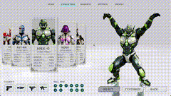

# Dilum Sanjaya

Vibe coded a game character selection screen

Everything here was made with AI tools
Nano Banana: character design + UI
Tencent Hunyuan3D: image to 3D
Gemini Pro: UI

More details ↓

![../../x-videos/DilumSanjaya-2008584593222652057.mp4]

[原始视频] | [X 链接](https://x.com/DilumSanjaya/status/2008584593222652057)

## 文字稿

请不吝点赞 订阅 转发 打赏支持明镜与点点栏目请不吝点赞 订阅 转发 打赏支持明镜与点点栏目
