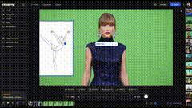

# el.cine

wow.. Freepik brings nano banana to next level..

we can use sketches to control actor's pose accurately and then use keyframe to make her dance.. change bg, direct actor and camera..

this is a great way to do film composition

step by step tutorial:

![../../x-videos/EHuanglu-1965434306173829197.mp4]

[原始视频] | [X 链接](https://x.com/EHuanglu/status/1965434306173829197)

## 文字稿

字幕志愿者 杨茜茜
