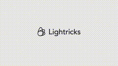

# ElevenLabs

LTX-2 and its latest feature, Retake, are now available in ElevenLabs Image & Video.

Retake lets you edit specific sections of a shot, with timecodes, while maintaining full visual consistency.

Change the action. Adjust the phrasing. Shift the camera angle.

![[../../x-videos/ElevenLabs-1994120106310287793.mp4]]

[原始视频](../../x-videos/ElevenLabs-1994120106310287793.mp4) | [X 链接](https://x.com/ElevenLabs/status/1994120106310287793)

## 文字稿

LTX2 from Lightrix and its latest feature,Retake, have arrived on Eleven Labs, our newest additions to a rapidly growing family of models built for power and flexibility. Generate anything you can imagine, all in one place. So try it today with Eleven Labs.
