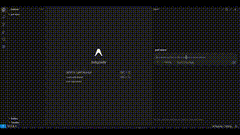

# AshutoshShrivastava

This is next level vibe coding.

Google new IDE Antigravity is incredible when you combine Nano Banana Pro for layout and Gemini 3.0 Pro for coding.
Process:
- Antigravity creates the layout design and plan
- You review it and provide feedback
- Antigravity builds the webpage

![../../x-videos/ai_for_success-1991907716865069378.mp4]

[原始视频] | [X 链接](https://x.com/ai_for_success/status/1991907716865069378)
