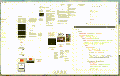

# Igor bedesqui

i shit you not, it's an IDE AND has browser embeds, so I can localhost multiple pages at once in the same canvas

obsidian's canvas being able to embed ANYTHING, and the
@obsdmd
editor being literally just code-mirror, makes it the perfect worspace
(
@tldraw
is also cool)

![[../../x-videos/bedesqui-2029182297652531645.mp4]]

[原始视频](../../x-videos/bedesqui-2029182297652531645.mp4) | [X 链接](https://x.com/bedesqui/status/2029182297652531645)
