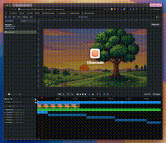

# Riley Brown

I spent 5 hours today making OpenClaw even better at Motion Graphics

I created the video below in 2 prompts with no asset uploads. It scraped or generated everything from a text prompt.

I've added:
- better brand scraping
- image generation
- video generation
- music generation

![[../../x-videos/rileybrown-2029031830855532627.mp4]]

[原始视频](../../x-videos/rileybrown-2029031830855532627.mp4) | [X 链接](https://x.com/rileybrown/status/2029031830855532627)

## 文字稿

字幕志愿者 李宗盛优优独播剧场——YoYo Television Series Exclusive
