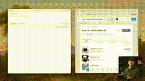

# Ryo Lu

we turned the lights back on

try the new Cursor Light theme made by
@rikcreation

cleaner, simpler agent coming soon

![[../../x-videos/ryolu_-1970614805120913842.mp4]]

[原始视频](../../x-videos/ryolu_-1970614805120913842.mp4) | [X 链接](https://x.com/ryolu_/status/1970614805120913842)

## 文字稿

所以Figma就出了新 MCP server和GPT5Codex是現在在Cursor所以我想要把整個設計的設計和看法做的模式所以在左邊我已經有Cursor然後我已經有FigmaMCP然後在右邊我已經有Figma設計我找到FigmaCommunity所以我會選擇然後選擇這個設計然後選擇這個設計進入CursorAgent chat現在MCP能夠招出資料我们的项目可以把整个项目的设计用Figma's dev mode它可以把视频的设计它可以把其他设计的设计它可以把整个项目的设计和其他设计的项目可以看到这个设计现在,这个模式是在做的它叫做的设计它叫做的设计这些设计是有很多东西这些设计的东西它们是在做的现在,它们是在做的所以,这个是在做的我要先讲一下这个设计一样的原因是一样的原因我找到这个设计的Figma community它有一个好处的东西我认为这些设计的设计我认为这些设计的设计有些图的一样这些是有个障碍的这些是有个障碍的我认为是继续的继续它们继续的继续它们继续的继续它们是很难以为它们会有个障碍的继续或是Grid我不太清楚如何它會做但也有些是一些所以我們會看到SVG是正確不是一個公文但這就是我會想到這裏的設計是很快這會是一個地方會建立建立在Figmt be a spot where a designer would kind of build something, mock it up inside of Figma. And when they're ready to prototype what it actually feels like to click through the app. Maybe you want to have a nice animation when the order goes from confirm to ship and you can kind of see that move live. Or maybe these rows should shift down when a discount code is applied and there's like a little celebratory animation there.you can take that into code prototype this live using the cursor agent see how it feels with realcode and then hand off this design hand off this prototype so that folks can understand what you're trying to implement so we see that the cursor agent is building this order tracking file if i go back to the main cursor view i just got a basic react app that i started with bun init所以我沒有任何東西前面,就是基本上的基本上我用這個新的Viewer和CursorAgent的同樣,同樣的左邊的左邊,但是它是更多的在你身上的實際上可以在你身上的實際上和您的實際上的實際上和您的實際上的實際上所以這會有新的進步在其他旅程上的Cursor它是在其他旅程的內如果您想試一下現在所以看起來我們有些改變然後我們來做這個更多的let's pull this over here we've got this kind of unified diff view so got ourorder tracking file seems good we've got changes to our main entry point into our app that seems fine another nice thing about kind of building with react is that I think for a lot of designers the component model really helps click in在你的eir brains, especially with the readability of Tailwind classes. You might not be an expert on CSS yet or on HTML yet. Maybe this is your first jump into kind of getting into the code. But I find that the self-contained composability of a component kind of maps to how you would do things in the Figma, you know, left sidebar, how you would do your layers, for example. So it looks like we have something done.打開搜尋,我會去打開搜尋,看這可以做成功,我可以拔開搜尋,這可以看,所以它會開始在Localhost3000,我們試這個,OK,我們有什麼,我們還沒有這個,我們還沒有這個,笨拇等, which is just hilarious and really fun to look at. So as I expected, this horizontal bar, the models are just really not great at. But other than that, it pulled the images correctly from the Figma file, which is nice. The aspect ratio on that seems a little bit off. These SVGs are correct. What else?我只能去看它它看起來很近一定會很近一定會很近在這裏面上它們也有了現在我可以說解決了解決了 credit card icon然後我可以說en how do I want to describe thisFixoh this is still going herelet's pop this inFix theFix theOrderTrackerIt's like the Domino's Pizza thingI think that's the canonical name for itFix the OrderTrackerHorizontalBar它是不正常的在那些上的在那些上的我认为那些那是我的最好的方法我认为这些方法我认为这些方法看起来的它看起来它看起来的它看起来的在那些上的所以那是很好的什么 else它可能是一种大我们可能会比较小但总之后I'm pretty happy with how close it did for a one shotespecially since I didn't have to tell anythingI just gave it the figma fileand then it's very easy for us to kind of promptand follow up from hereI'm curious how close those buttons areI didn't look at that too quicklyseems like the SVGs are pretty accuratethey're not 100% accuratebut I could ask for a change on thatSo yeah honestly not too badI'm curious what you all think如果這就像是一個你用的東西這就像是我的追求這是一個很可怕的問題但我修理了解決定的方法它們的效果我現在就有了解決定的方法然後它們的效果所以,不太好我沒有用了解太多了但我第一印象是不太好並且配合了解決定的方法讓我知道你覺得
