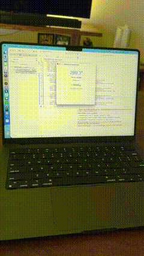

# sam henri gold

Did you know your MacBook has a sensor that knows the exact angle of the screen hinge?

It's not exposed as a public API, but I figured out a way to read it and make it sound like an old wooden door.

![../../x-videos/samhenrigold-1964428927159382261.mp4]

[原始视频] | [X 链接](https://x.com/samhenrigold/status/1964428927159382261)

## 文字稿

字幕志愿者 杨茜茜
